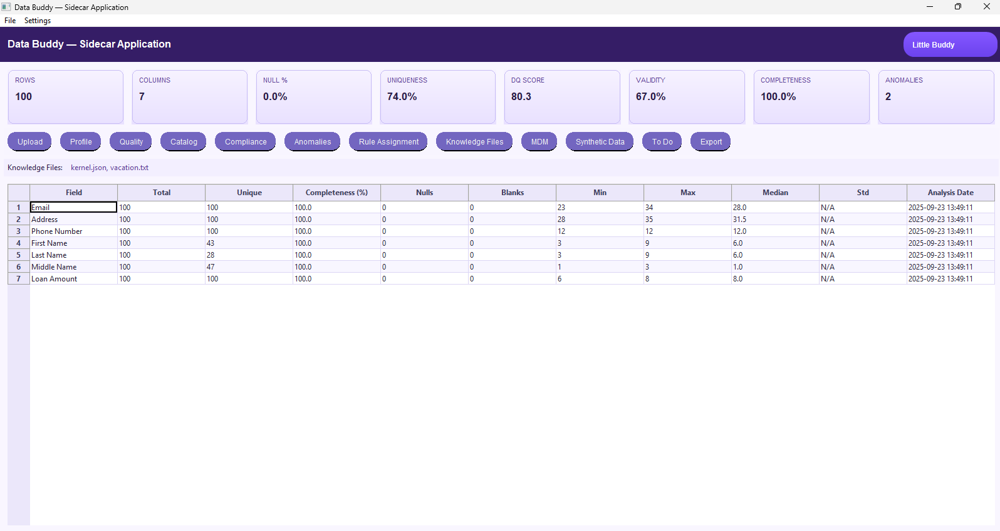

# Data Profiling

# High Performance Advanced Data Profiling


Get a fast understanding of a dataset’s **shape, quality, and risk** before you build rules or dashboards.

<div class="grid cards" markdown>

- :material-file-search: **What it does**  
  Schema & type inference, basic statistics, distributions, uniqueness, null/blank counts, and outlier hints.

- :material-speedometer: **Why it matters**  
  Catches issues early (PII, empties, skew), guides **Data Quality** rule design, and speeds up onboarding.

- :material-database-arrow-right: **Typical inputs**  
  CSV, Parquet, or table references.

- :material-file-chart: **Outputs**  
  HTML/CSV reports, JSON summary, exports to evidence packages.

</div>

---

## Example run (UI)

<figure markdown>
  { .screenshot }
  <figcaption>Data Buddy — Profile analysis with completeness, uniqueness, min/max, median, and standard deviation per field.</figcaption>
</figure>

---

## Quickstart

=== "UI"
    1. **Upload** a file or choose a table.  
    2. Click **Profile** → Data Buddy computes schema, stats, and quality signals.  
    3. **Export** results as CSV/JSON and attach to your evidence pack.

=== "CLI (placeholder)"
    ```bash
    python -m databuddy profile data/synthetic_parts_10000.csv \
      --summary out/profile/synthetic_parts_10000.json \
      --report  out/profile/synthetic_parts_10000.csv
    ```

---

## What to look for

- **Completeness** – fields with low non-null ratios usually need rules or defaults.  
- **Uniqueness** – candidate keys and dedupe hints.  
- **Ranges & distribution** – suspicious min/max, spikes, long tails → check for unit or parsing issues.  
- **Outliers** – values far from the median/stdev often indicate data entry or integration problems.  
- **PII/PHI** – scan names/emails/IDs to drive **Classification** and access controls.

---

## Suggested next steps

- Turn findings into **Data Quality** rules (accuracy/completeness/timeliness/consistency/validity/uniqueness).  
- Capture business meaning and owners in **Data Cataloging**.  
- Enable **Anomaly Detection** on critical metrics.  
- Automate the profiling → DQ → report flow in **Workflow Automation**.

---

## Outputs (example fields)

| Field | Type | Records | Unique | Completeness | Min | Max | Median | StdDev |
|---|---|---:|---:|---:|---:|---:|---:|---:|
| `part_number` | string | 10,000 | 10,000 | 100% | — | — | — | — |
| `part_cost` | decimal | 10,000 | 9,798 | 100% | 0.51 | 2,499.98 | 1,244.53 | 718.49 |
| `number_of_units` | int | 10,000 | 4,295 | 100% | 1 | 5,000 | 2,489.5 | 1,444.14 |

!!! tip "Export & share"
    Include the CSV/JSON profile in your change ticket or governance evidence pack so reviewers can reproduce findings.
