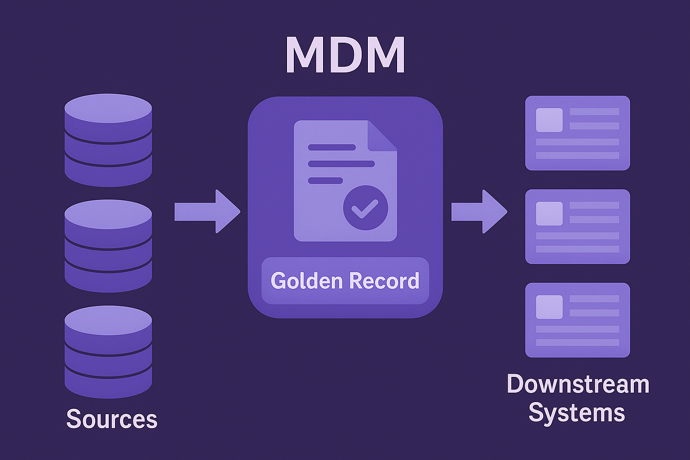
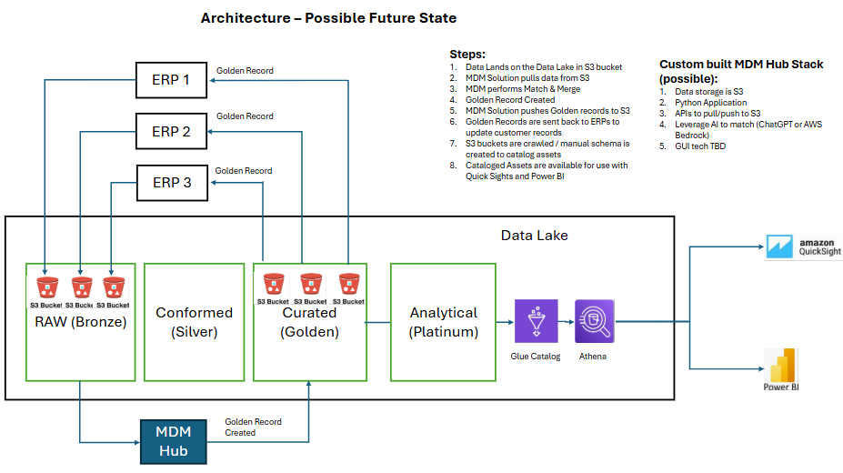

# Master Data Management (MDM) Hub

# Master Data Management (MDM)

> A **sidecar-style MDM hub** connects to a data source that aggregates multiple third-party vendor systems (**ERPs**), **pulls** the records into the hub, **matches & merges** them to produce a **Golden Record**, and then **redistributes** those Golden Records back to the sources for reconciliation and to downstream destinations (e.g., curated/reporting layers) for analytics and accounting—**without** standing up a heavy framework, pipeline, or config files.

## Why an MDM hub?
- :material-account-box-multiple: **Single source of truth** — consistent customer/product/vendor entities across ERPs.
- :material-swap-horizontal-bold: **Operational feedback** — push Golden Records back to originating ERPs to correct or reconcile.
- :material-shield-check: **Governed & auditable** — stewardship workflow, lineage, and evidence for audits.
- :material-speedometer: **Fast to adopt** — run as a sidecar app; no changes to existing ETL.

## High-level architecture

<figure markdown>
  { .screenshot }
  <figcaption>Possible future state: data lands in the lake, MDM hub performs match-merge to create Golden Records, pushes results back to ERPs for reconciliation, and publishes curated assets for BI (Athena/QuickSight/Power BI).</figcaption>
</figure>

## How it works (typical flow)
1. **Land** ERP data into the lake/landing zone (e.g., S3).  
2. **Ingest** into the **MDM hub** (sidecar app) — pull snapshots or increments.  
3. **Standardize & cleanse** (trim, casing, normalize codes, reference data lookups).  
4. **Match & merge** — identity resolution + survivorship rules to create the **Golden Record**.  
5. **Redistribute**:  
   - **Back to sources** (ERPs) for reconciliation/correction.  
   - **To curated/reporting layers** for analytics, accounting, and downstream apps.  
6. **Catalog & lineage** entries are created/updated; **DQ** and **policy checks** run; **alerts** raise on exceptions.

## Common actions
- Standardization, parsing, and enrichment  
- Deterministic + probabilistic **matching**  
- **Survivorship** (source priority, timeliness, field-level confidence)  
- **Reference data** sync (codes, hierarchies)  
- **Stewardship** queue for ambiguous matches  
- **Change data** publishing (delta feeds, events)

## Implementation notes
- **Inputs:** tables/files from multiple ERPs; optional CDC/incremental extracts; reference datasets.  
- **Outputs:** Golden Records table; change log/events; exception buckets; curated analytic assets.  
- **Security:** PII handling, row/column masking, audit logs, SoD checks.  
- **Ops:** scheduled or event-driven; idempotent processing; health & value KPIs (match rate, steward MTTR, golden coverage).  

## Related accelerators
- [:material-account-cog: Data Buddy](../data-buddy/index.md) — profiling, DQ, cataloging, anomalies  
- [:material-puzzle: Sidecar Applications](../sidecar-applications/index.md) — architecture pattern used by the hub  
- [:material-robot-excited: Synthetic Data Generator](../synthetic-data-generator/index.md) — test data for match/merge tuning
